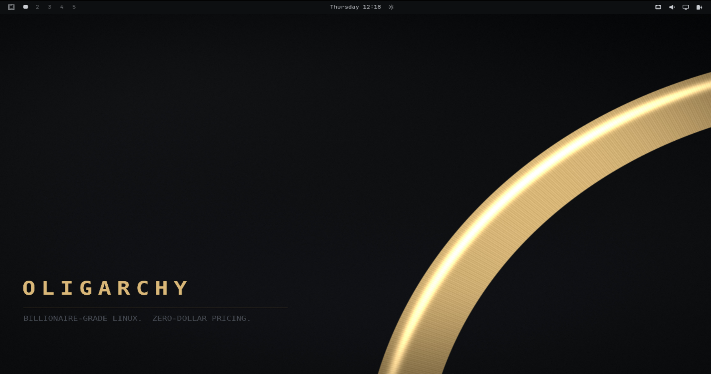
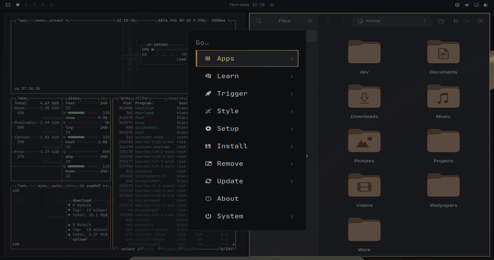
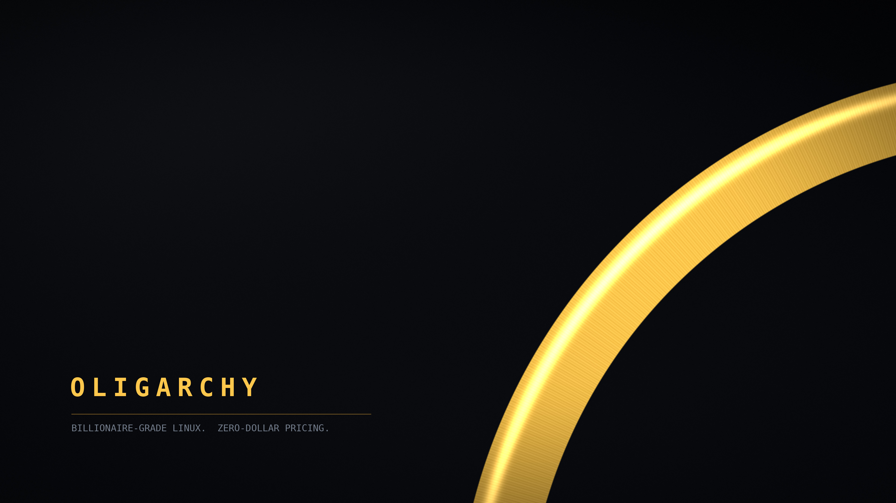

# Oligarchy

An [Omarchy](https://omarchy.org) theme. Near-black charcoal, champagne gold,
and a terminal palette sharp enough to work in. Billionaire-grade Linux,
zero-dollar pricing.





## Install

```
omarchy theme install https://github.com/zuhaibullahbaig/omarchy-oligarchy-theme.git
```

To switch to it later:

```
omarchy theme set oligarchy
```

Cycle the wallpapers with `omarchy theme bg next`, or open the picker with
`omarchy theme bg-switcher`.

## Update

```
omarchy theme update
```

## Remove

```
omarchy theme remove oligarchy
```

## Backgrounds



`01-oligarchy.jpg`


`02-oligarchy.jpg`

To add your own without touching this repo, drop images into
`~/.config/omarchy/backgrounds/oligarchy/`.

## Palette

| | |
| --- | --- |
| background | `#121417` |
| dark background | `#0d0f11` |
| darker background | `#08090a` |
| lighter background | `#1a1d21` |
| foreground | `#c9ccd1` |
| accent | `#d9b779` |
| selection | `#2a2419` |
| muted | `#4a4f57` |

| | normal | bright |
| --- | --- | --- |
| red | `#d1603f` | `#e07a58` |
| green | `#9fb56a` | `#b8cc82` |
| yellow | `#e8c274` | `#f2d590` |
| blue | `#7d9ec4` | `#96b4d6` |
| magenta | `#c08fa8` | `#d3a6bb` |
| cyan | `#7fbdb2` | `#96cfc6` |

Every gradient in the theme — window borders, the bar's edge, focus rings,
the arc in the first wallpaper — is struck at 135°, lit from the upper left.
Selected and focused surfaces carry a champagne left edge. Icons are
`Yaru-wartybrown`.

Fonts are set by you, not the theme: Style → Font.

## License

Theme files are MIT (see `LICENSE`). Wallpapers are free to use and
redistribute with the theme.
